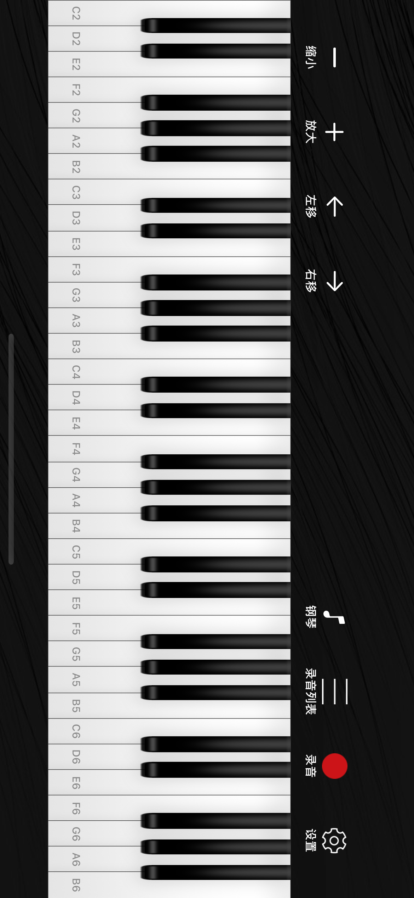
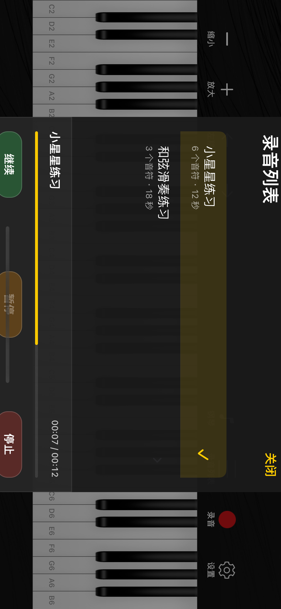
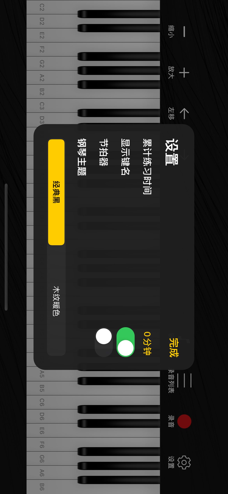

# XiaChenPiano

一个面向儿童钢琴练习的 iOS 应用，使用 Swift 实现，支持真实采样音色、多指弹奏、滑动连弹、录音保存与回放。

## 截图

### 主界面



### 录音回放与进度控制



### 设置面板



## 主要功能

- 真实钢琴键盘布局，支持 `C2-B6` 键域、缩放、左右平移。
- 支持多指同时弹奏、滑动跨键连弹、按下动态反馈。
- 录音保存、重命名、删除，以及录音回放。
- 回放时支持播放、暂停、停止，并展示实时进度。
- 回放时钢琴键会同步高亮对应按键。
- 支持多种采样音色切换和节拍器。
- 设置面板支持键名显示、节拍器、主题切换。

## 开发环境

- Xcode 17+
- iOS 14.0+
- Swift 5
- 布局：SnapKit
- 调试辅助：LookinServer 通过 CocoaPods 在 Debug 配置接入

## 目录结构

```text
XiaChenPiano/
├── App/          // 环境注入
├── Core/         // 音符、视口、录音、回放时间线等核心模型
├── Resources/    // 音频资源
├── Services/     // 采样播放器、回放控制、录音存储、练习统计
├── UI/           // 主界面、录音列表、设置面板
└── Assets.xcassets
```

## 运行项目

1. 使用 `XiaChenPiano.xcworkspace` 打开工程。
2. 选择 `XiaChenPiano` scheme。
3. 运行到 `iPhone 14 / iOS 16.4` 或其他 iOS 14+ 设备。

常用命令：

```bash
xcodebuild test \
  -workspace XiaChenPiano.xcworkspace \
  -scheme XiaChenPiano \
  -destination 'platform=iOS Simulator,OS=16.4,name=iPhone 14' \
  -only-testing:XiaChenPianoTests

xcodebuild build \
  -workspace XiaChenPiano.xcworkspace \
  -scheme XiaChenPiano \
  -destination 'platform=iOS Simulator,OS=16.4,name=iPhone 14'
```

## 资源说明

- 音频资源位于 `XiaChenPiano/Resources/Sound`
- 图片资源位于 `XiaChenPiano/Assets.xcassets`
- 如需补充素材，可从仓库中的 `Piano/` 目录继续提取和整理

## 截图生成

README 中的截图通过模拟器生成，应用内置了仅用于截图的隐藏启动参数：

```bash
xcrun simctl launch booted cn.vanjay.XiaChenPiano
xcrun simctl launch booted cn.vanjay.XiaChenPiano -uiPreviewPlaybackPanel
xcrun simctl launch booted cn.vanjay.XiaChenPiano -uiPreviewSettings
```

对应图片输出到 `docs/screenshots/`。
